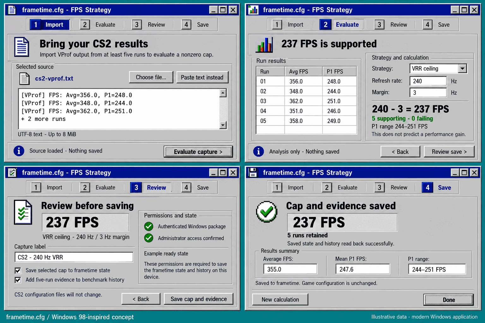
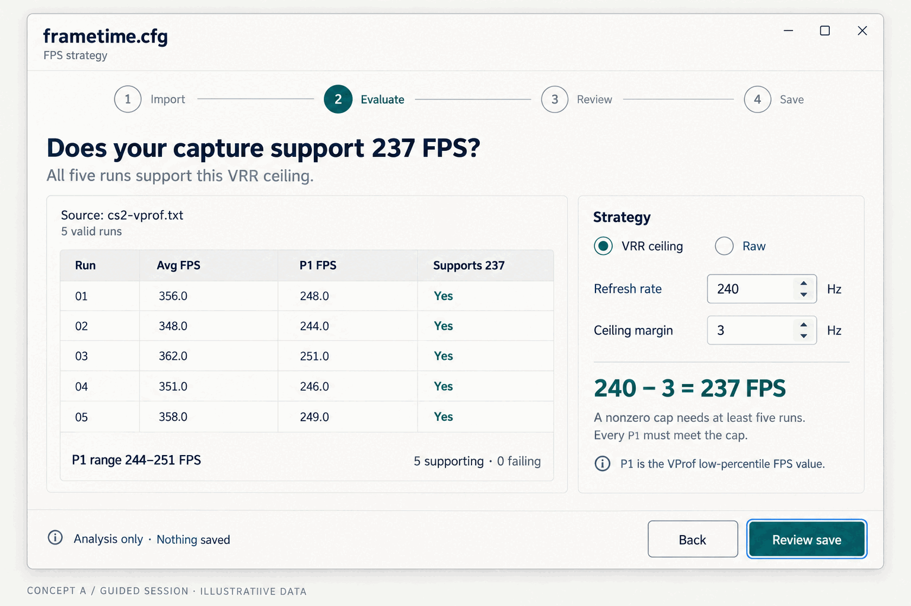
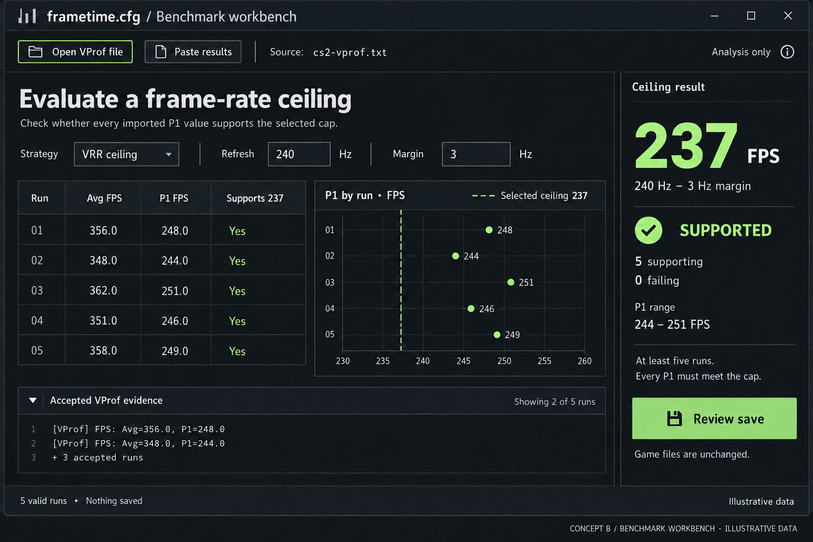

# frametime.cfg

[](https://github.com/sebastianspicker/frametime-cfg/actions/workflows/rust.yml)
[](https://github.com/sebastianspicker/frametime-cfg/actions/workflows/security.yml)

[](licenses/LICENSE)

`frametime.cfg` is an alpha, native Rust workflow for inspecting, planning,
applying, verifying, and recovering selected Counter-Strike 2, graphics-driver,
network, power, and Windows settings. It is built for x64 Windows machines
managed by an administrator who wants to see the change, understand it, and
have a way back.

> **Status: alpha, and not yet qualified on Windows hardware.** Source tests
> prove the Rust contracts and the fail-closed behavior; they do not qualify
> UAC, Safe Mode, drivers, NVAPI, Windows APIs, hardware, or a complete reboot
> sequence. The project makes no claim of universal FPS, frame-time, latency,
> image-quality, or stability gains.

## What it does

- **Inspects and plans.** `dry-run` renders every supported check and change as
  a typed plan without persistence, elevation, or Windows mutation.
- **Evaluates benchmark evidence.** Import VProf output and decide whether a
  proposed FPS cap is supported by the measured per-run P1 values.
- **Runs guarded Windows work.** A three-phase normal-boot → Safe Mode →
  normal-boot workflow captures state before mutation and binds recovery to the
  exact target identity.
- **Fails closed on unauthenticated input.** State-changing commands require an
  authenticated package; a source build, copied executable, or unsigned package
  only gets the read-only preview.
- **Ships two frontends.** `frametime.exe` is the terminal entrypoint and
  `frametime-gui.exe` is a Win32 desktop entrypoint over the same application
  layer.

## Design concept tour

These are design explorations, **not screenshots of an installed build**. The
current GUI is assembled from real Win32 controls in a Windows 98-inspired
skin; the four-screen flow below is the implementation reference, and the two
alternates are earlier, unreleased directions kept for context.

**The four-stage flow — Import → Evaluate → Review → Save** (implementation
reference):

[](docs/assets/concepts/guided-session-flow.png)

**Concept A — a guided session.** A light workspace where the evidence rule and
the save boundary stay in the user's path:

[](docs/assets/concepts/guided-session.png)

**Concept B — a benchmark workbench.** A denser layout that keeps every run, a
P1 plot, and the verdict visible at once for repeated analysis:

[](docs/assets/concepts/benchmark-workbench.png)

The mockups use illustrative data and carry no performance claim. See
[Native GUI](docs/native/gui.md) for the implemented flow and its validation
boundary, or view the [live demo](https://sebastianspicker.github.io/frametime-cfg/).

## Repository components

| Path | Purpose | Role |
| --- | --- | --- |
| `crates/frametime-domain` | Platform-neutral policy, state, evidence, recovery, and workflow contracts | Root workspace library |
| `crates/frametime-windows` | Windows adapters, trusted storage, package authentication, native integrations | Root workspace library |
| `crates/frametime-app` | Shared command and use-case orchestration | Root workspace library |
| `crates/frametime-cli` | `frametime.exe` terminal interface | Root workspace binary |
| `crates/frametime-gui` | `frametime-gui.exe` desktop interface | Root workspace binary |
| `repo-checks` | Repository policy check helpers | Root workspace member, never packaged |
| [`tools/northclock`](tools/northclock/README.md) | Archived, unsupported reference workspace | Source, history, and security reporting retained |
| [`tools/driver-foundry`](tools/driver-foundry/README.md) | Archived, unsupported reference workspace | Source, history, and security reporting retained |

The five application crates and `repo-checks` form the root workspace. Northclock and Driver
Foundry are not dependencies of it and are excluded from active CI, Dependabot,
issue routing, packaging, and contributor workflows. Root hardware diagnostics
are independent read-only observations, not part of the profile policy.

## Prerequisites

- Rust 1.96.0 with `rustfmt`, Clippy, and the `x86_64-pc-windows-msvc` target,
  pinned by [`rust-toolchain.toml`](rust-toolchain.toml).
- Windows x64 for live behavior and package assembly. Host builds and
  cross-compilation are useful for source validation only.
- Administrator access and an authenticated release package for any
  state-changing operation.

## Build and preview from source

Run these from the repository root. A source checkout can build, test, and run
the strict preview, but it has no package authority.

```sh
cargo build --workspace --locked
cargo test --workspace --all-targets --all-features --locked
cargo run -p frametime-cli --locked -- dry-run all
```

`dry-run` takes an optional GPU branch: `1` for NVIDIA RTX 5000, `2` for
NVIDIA, `3` for AMD, `4` for Intel Arc, or `all`. It performs no persistence,
elevation, or Windows mutation.

The full contributor gate — formatting, Clippy, architecture checks, and the
Windows target check — is in [CONTRIBUTING.md](CONTRIBUTING.md). Authenticated
and unsigned package commands are in
[release packaging](docs/DEPLOYMENT.md).

## Configuration and state

[`frametime.toml`](frametime.toml) is the authenticated configuration input and
[`assets/`](assets/) holds the canonical packaged CFG and video-data inputs. The
configuration controls FPS-cap policy, approved cache paths, and autostart
targets; it does not select the work directory. The exact schema and precedence
are in [configuration](docs/CONFIGURATION.md).

Runtime state belongs to the Windows adapter under the fixed protected root
`C:\FRAMETIME_CFG`. Fresh mutations use the configuration snapshot that was
authenticated with the package; resumed reboot work uses the snapshot inside the
verified selected runtime. Replacing files in either location grants no
authority.

## Package and operating model

An authenticated portable package contains the two signed PE entrypoints, the
payload listed in [`package-layout.txt`](package-layout.txt), an exact package
manifest, and a signed catalog. Before any mutation the executable verifies the
package root, the full file inventory, identities, hashes, catalog membership,
publisher pin, and its own executable role. An unsigned package, a copied
executable, an arbitrary source build, or a build without a publisher pin fails
closed for mutation.

The workflow can span three authenticated stages: normal-boot preparation, Safe
Mode work, and same-user normal-boot completion. Read
[operations](docs/native/operations.md) and
[recovery](docs/native/recovery.md) before exercising a live package.

## Documentation

- [Documentation index](docs/README.md)
- [Architecture](docs/architecture.md)
- [Configuration](docs/CONFIGURATION.md)
- [Native operations](docs/native/operations.md)
- [Recovery](docs/native/recovery.md)
- [Compatibility and qualification](docs/native/compatibility.md)
- [NVIDIA driver lifecycle](docs/native/driver-lifecycle.md)
- [Package security](docs/package-security.md)
- [Release packaging](docs/DEPLOYMENT.md)
- [Contributing](CONTRIBUTING.md)
- [Code of conduct](CODE_OF_CONDUCT.md)
- [Security policy](.github/SECURITY.md)
- [Live demo](https://sebastianspicker.github.io/frametime-cfg/)

## License

The root workspace is released under the [MIT License](licenses/LICENSE).
Third-party attributions are in
[`licenses/THIRD_PARTY_NOTICES.md`](licenses/THIRD_PARTY_NOTICES.md).
