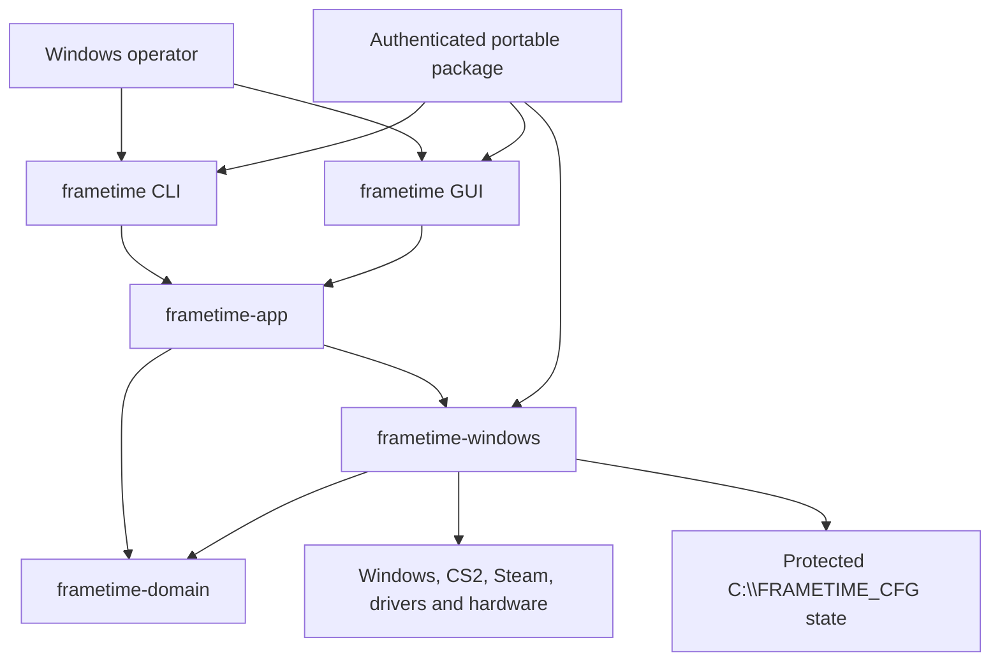
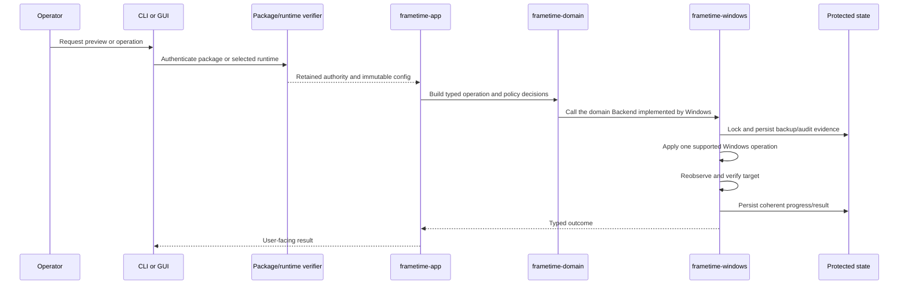

# Architecture

## Scope

The repository is one five-crate application plus two archived reference
workspaces. The application turns authenticated configuration and user commands
into typed plans, captures recoverable state, performs the supported Windows
operations, and verifies the results. Root hardware diagnostics are independent
read-only observations, not part of profile mutation or the archived tools.

Only the five-crate root workspace is actively supported. Northclock and Driver
Foundry are archived: their READMEs describe the retained source and its limits,
and they are excluded from CI, dependency automation, packaging, and the
contributor workflow. The root profile policy covers five settings. Production
signing stays with the vendor; lab signing is isolated, export-only, and
unqualified. The [NVIDIA driver lifecycle](native/driver-lifecycle.md) defines
the versioned transaction, component catalog, DRS merge policy, and
qualification boundary.

## System context

The dependency direction is `domain <- windows <- app <- cli/gui`:

- `frametime-domain` owns the platform-neutral pieces: configuration
  validation, catalog entries, policy, state transitions, evidence, recovery
  contracts, and persistence formats.
- `frametime-windows` implements the Windows boundary the domain talks to:
  protected storage, package and runtime trust, discovery, planning, mutation,
  readback, reboot handoffs, and native integrations.
- `frametime-app` exposes typed commands, outcomes, and read models, and
  coordinates use cases without letting callers choose persistence paths.
- `frametime-cli` and `frametime-gui` translate input and output. They may use
  domain presentation values and narrowly scoped Windows startup or
  native-window plumbing, but workflow decisions stay in the app and domain
  layers.

Public surfaces are deliberately narrow:

- Domain items are reached only through their owning module
  (`frametime_domain::backup::BackupFile`); the crate root exports modules and
  `PRODUCT_VERSION`, nothing else.
- `frametime-windows` publishes one explicit list in `src/lib.rs`, identical on
  every target. Off Windows the native operations are fail-closed stubs, so
  the app, frontends, and source preview build and test on any host. Because
  of those stubs, host builds allow dead code in this crate, and the
  Windows-target Clippy run is the authority for it.

The unpublished [`repo-checks`](../repo-checks) workspace member enforces the
dependency direction (including rejecting reverse edges), domain purity, the
frontend-to-app boundary, the native package surface, a 600-line file cap, and
exact-clone detection. It runs as part of `cargo test --workspace` on every
platform, including the Windows gate.

## Primary runtime flow

Preview stops before authority, persistence, elevation, or Windows mutation. A
live backend first takes the fixed trusted work directory and requires
elevation. Cancellation is observed between workflow steps, never inside an
in-progress native mutation.

## Package and configuration authority

[`package-layout.txt`](../package-layout.txt) is the portable package inventory.
An authenticated release adds `package.manifest.json` and `package.cat` on top
of it and verifies the complete file set, hashes, catalog membership, executable
roles, publisher pin, package root, and retained identities. The configuration
is kept as the exact authenticated byte snapshot, so code never reopens a
mutable ambient configuration path mid-operation.

Fresh work uses the package snapshot; resumed reboot work uses the snapshot
inside the verified selected runtime. Runtime publication has its own compiled
24-file payload contract, so the release package and the reboot runtime are
related but separate inventories. See [configuration](CONFIGURATION.md),
[package security](package-security.md), and [deployment](DEPLOYMENT.md).

## State, evidence, and recovery

The Windows adapter exclusively owns live state under `C:\FRAMETIME_CFG`. It
validates the fixed root and its ACL/handle boundary, uses locks and atomic
writes where the storage contract requires them, and reads critical data back
after writes. State covers workflow progress, backups, audit and irreversible
operation evidence, driver transactions, benchmark history, and selected
runtime generations.

The domain engine captures and persists applicable state before mutation.
Restore paths act only on captured, identity-bound targets and fail closed when
state is missing or incoherent. This is transaction evidence, not a system
image or a universal rollback facility. See
[operations](native/operations.md) and [recovery](native/recovery.md).

## Windows and external boundaries

`frametime-windows` owns the registry, services, Task Scheduler, WMI, SetupAPI,
networking, filesystem, process, graphics, WinTrust, and driver-facing calls.
External system tools come from a compiled allowlist, resolve below System32,
and receive typed arguments rather than caller-provided command text. NVIDIA
acquisition is restricted to a compiled host and a server-relative path, then
checked through package and driver trust policy.

Package authentication and elevation are the authorization boundaries; there is
no application account or network authentication system. Publisher pins are
compile-time release inputs. Signing private keys and certificates are external
release infrastructure and must never enter the repository.

## Reboot topology

The driver workflow may publish a verified runtime and span three stages:

1. **Phase 1 — normal boot.** Captures state and may arm an exact Safe Mode
   handoff.
2. **Phase 2 — Safe Mode.** Verifies the selected runtime and handoff, performs
   its guarded work, clears Safe Boot, and records the same-user Phase 3
   handoff.
3. **Phase 3 — normal boot.** Verifies the retained runtime and user binding,
   completes guarded work, and clears the handoff only after coherent success.

The selected runtime and handoff records are capabilities, not resumable paths
that a caller may substitute. A missing or inconsistent stage fails instead of
guessing the next action.

## Build and deployment boundaries

The root workspace has its own lockfile and validation gates. The archived
workspaces keep their separate Cargo manifests and lockfiles as historical
records, not active validation lanes. Root release packaging consumes prebuilt
Windows CLI/GUI binaries and produces a portable directory and ZIP; it does not
package `repo-checks` or either archived workspace. CI assembles only the structurally checked
unsigned lane and never exercises authenticated signing.

## Invariants and non-goals

- No reverse dependencies, and no duplicated workflow policy in a frontend.
- The trusted work root, runtime payload, and package inventory are never
  caller-selectable.
- Hashes supplied by the same untrusted caller are not treated as independent
  authorization.
- Unsupported, unavailable, or unverified hardware behavior is reported as
  such, never as success.
- Source tests, mocks, cross-compilation, and protocol validation are not
  described as live Windows or hardware qualification.
- Universal performance gains and a general-purpose system rollback facility
  are not current capabilities. Archived Northclock and Driver Foundry content
  is not an active product claim.
